# README NBA Statisitics: Mod 2

By J Daniel Kim 

### Project Overview

Predicting how many points a player can score per season. 

### The area’s in which I looked to address are:

What features did I use?

What did the visualizations tell about my data?

What does the statistical techniques conclude about my data?

What model was best fit?

### Gathering of Data

The data has been collected form multiple sources on Kaggle. After merging the dataframes, the data ranged from 1950 to 2019 statistics of player's cumulative season of the year they played.  


## What did the visualizations tell about my data?

### Visualizations before cleaning the data


```python
from IPython.display import Image
```

The next few graphics are used to analyze the data and help make conclusions. 

In the graph below, there is a somewhat linear relationship between 3 point attempts and points scored per season. 


```python
Image(filename= "3PA_PTS_bball2.png")
```


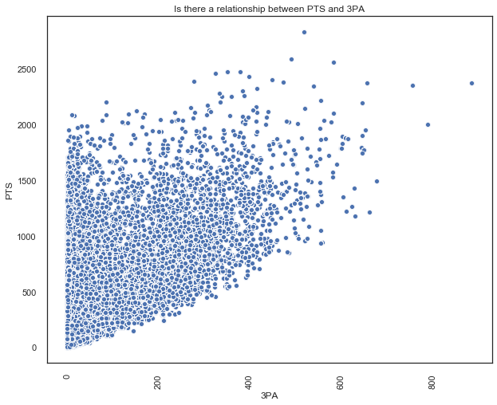


There is a linear relationship between 2 point attempts and points scored per season.


```python
Image(filename= "2PA_PTS_bball2.png")
```


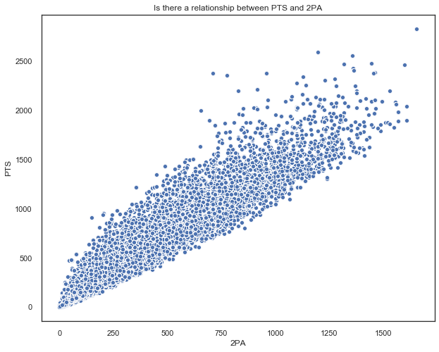


There is a linear relationship between free throw attempts and points scored per season.


```python
Image(filename= "FTA_PTS_bball2.png")
```


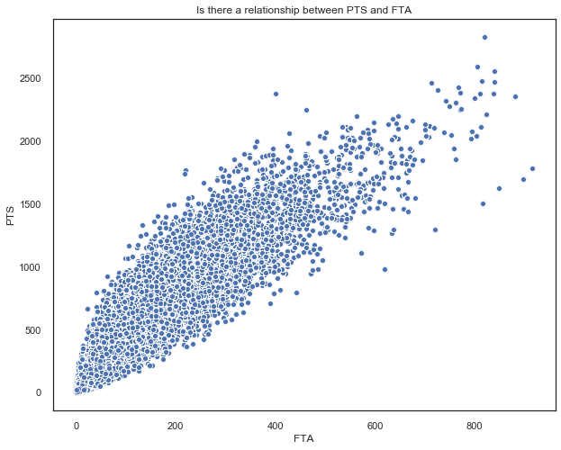


There is a somewhat linear relationship between assists and points scored per season.


```python
Image(filename= "AST_PTS_bball2.png")
```


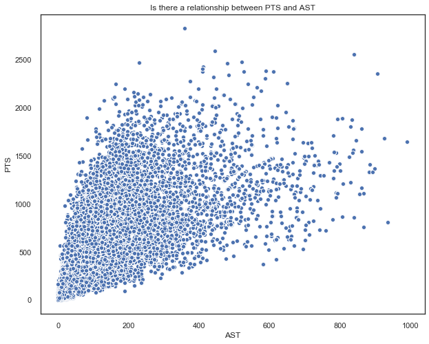


This is a correlation diagonal map, which displays the correlations between features to help decide what features to drop.


```python
Image(filename= "corr_bball2.png")
```


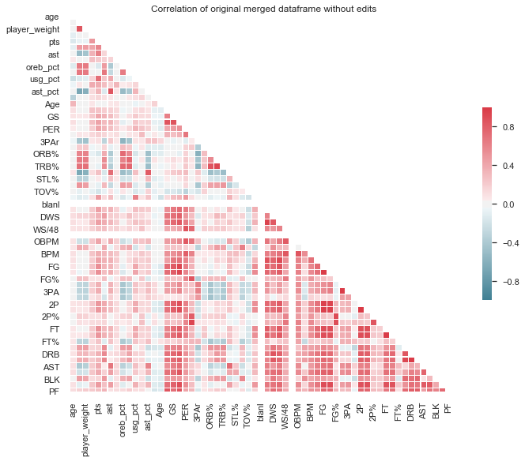


Checking to see if the teams variable is categorical, which I conclude it is.


```python
Image(filename= "team_PTS_bball2.png")
```


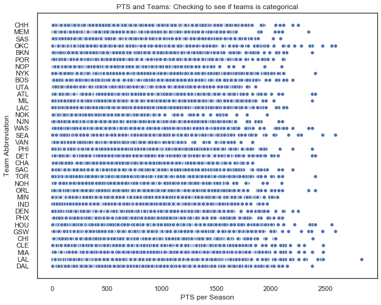


Checking to see if there was an overall proportional relationship between the variables height and weight. There seems to be a proportional relationship between the two variables.


```python
Image(filename= "Height_weight.png")
```


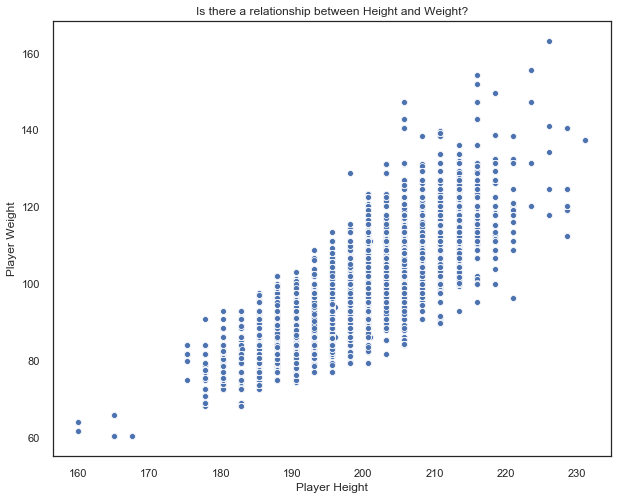


### Data cleaning

After drawing conclusions from the data visualizations. I have decided to drop several variables that had a correlation coefficient over 0.9 and those that had blank entries. Afterwards,  I created a feature for BMI (Body Mass Index) for each entry. Then I created dummy variables for teams, position, and draft round. Finally, since the three point line was created in 1979, I only kept observations from 1980 to 2019.

### Data visualizations after cleaning data

This is a correlation diagonal map, which displays the correlations after dropping the variables. 


```python
Image(filename= "corr_bball.png")
```


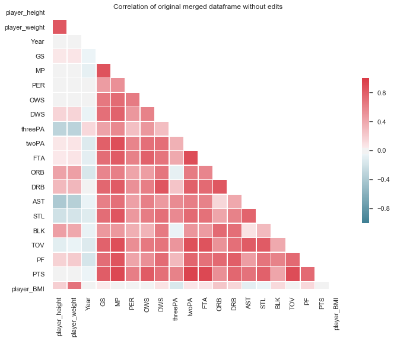


Trying to visualize the overall relationship of the amount of points scored during a season and the year. As you can see around 1998 there was a major dip, this was due to the lockdown that that shortened the season to 50 games. 


```python
Image(filename= "Year_PTS_bball.png")
```


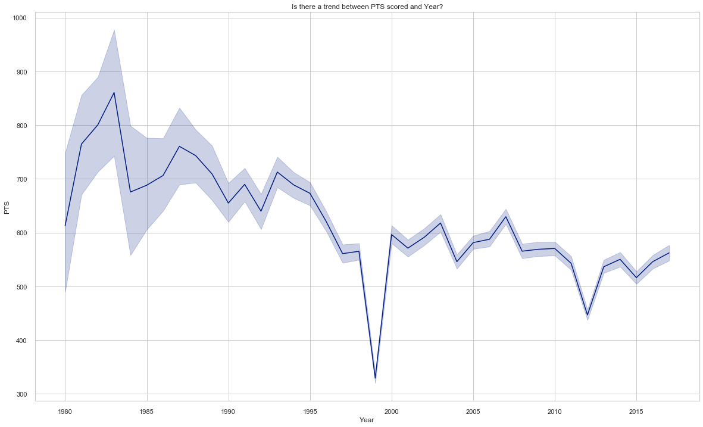


Checcking to see the overall relationship of starters scoring the most points. As you can see, the more games you start, generally the more points you score. 


```python
Image(filename= "PTS_GS_bball.png")
```


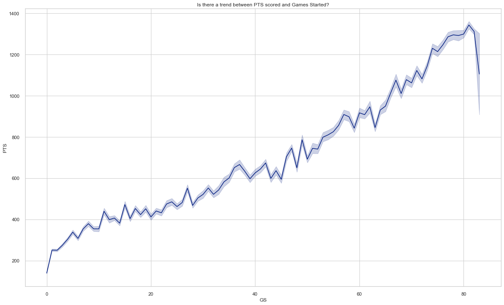


Players with BMI between approximatley 23 and 27 generally score the most points per season. 


```python
Image(filename= "BMI_bball.png")
```


## What features did I use?

The features I ended up using: height, weight, year, games started, minutes played, player efficiency rating, offessive win streak, defensive win streak, assist, steal, block, turn over, personal fouls, BMI, team dummies, position dummies, and draft round pick to predict points a player would score in a season.  

### Checking distribution of points

Distribution of PTS. We see that the distribution of PTS is highly skewed to the right. 


```python
Image(filename= "PTS_dist_bball.png")
```


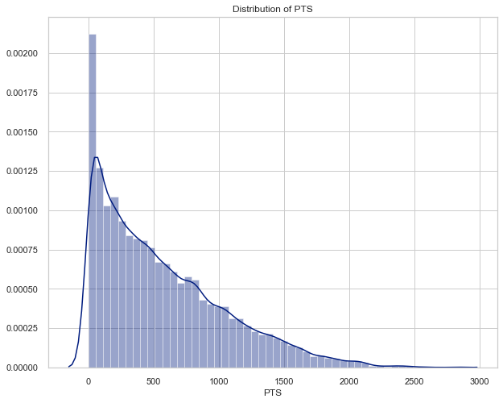


Using the Central Limit Theorem, we can see that by taking a large amount of samples from the population will aggregate to a normal distribution. 


```python
Image(filename= "Central_limit.png")
```


## What does the statistical techniques conclude about my data?

### ANOVA Test: Test whether there is a statistically significant difference in mean of PTS scored among teams

Ho: The mean of points scored per season of all the teams is the same

Ha : The mean of points scored per season of all the teams is not

P value is 6.419 * 20^-205. Since the P value falls below an alpha of 0.05, we reject the null hypothesis. Therefore, there is a statistically significant difference between the points scored between teams. 

### ANOVA Test: Test whether there is a statistically significant difference in the mean of PTS scored per season based on the country of origin

Ho: The mean of points scored per season between all the country is the same

Ha : The mean of points scored per season between all the country is not

P value is 0.922. Since the P value does not fall below an alpha of 0.05, we fail to reject the null hypothesis that there is a statistically significant difference between the points scored between country of origin. 

### Two sample ttest: Do players that played in the 1980's and 1990's  era score more points on average than one's from the 2000's?

Ho : mu 1900's points less than or equal to mu 2000's points

Ha: mu 1900's points more than mu 2000's points

The t-test pvalue is less than 0.001, therefore it falls below the rejection region of 0.05. I reject the null hypothesis. Thereby, players who played in the 80's and 90's scored more point on average than those in the 2000's.  

# What model was best fit?

For all of my models I have done a train test split of 80% train and 20% testing.

### The first model I ran was a linear regression model:

R^2 0.9984207306906915

Training Mean Absolute Error: 12.65108566448949

Training Mean Squared Error: 368.2856724155864

Training Root Mean Squared Error: 19.19077050083155

Testing Mean Absolute Error: 12.662490520269877

Testing Mean Squared Error: 369.46648007949216

Testing Root Mean Squared Error: 19.19077050083155

### The second model I ran was a second degree polynomial regression model:

R^2: 0.9991357581656568

Training Mean Absolute Error: 9.83300712314447

Training Mean Squared Error: 200.88813359609586

Training Root Mean Squared Error: 14.173501105799366

Testing Mean Absolute Error: 10.029451014339989

Testing Mean Squared Error: 222.7346559434921

Testing Root Mean Squared Error: 14.924297502512207

### Update in regression
After viewing these regressions I realized that there might be correlation issues with a few features such as three point attempts, two point attempts, and free throw attempts. Also, conceptually having the metrics of attempts to score can affect the outcome of predicting points scoring. I wanted to initially create a prediction without any statistics related to scoring and found out that having the metrics to attempts to score might hinder my results. Therefore, I decided to drop the variables twoPA', threePA ,FTA because they are strongly related with the actual number of points scored. I wanted to initially create a prediction without any statistics related to scoring and found out that this might hinder my results. I am aware that this will affect my RMSE. I also dropped the dummy variables because they were creating too many features for the regression model to load. 

### The first model I ran was a linear regression: 

R^2 0.9574272038225909

Training Mean Absolute Error: 69.32155913654168

Training Mean Squared Error: 9927.94847509249

Training Root Mean Squared Error: 99.63909109928939

Testing Mean Absolute Error: 69.65037399886508

Testing Mean Squared Error: 9959.927161655318

Testing Root Mean Squared Error: 99.63909109928939

### The second model I ran was a second degree polynomial regression: 

R^2: 0.9930710231963117

Training set - Features: (87610, 152) Target: (87610,)

Training set - Features: (21903, 152) Target: (21903,)

Training Mean Absolute Error: 27.48454635346112

Training Mean Squared Error: 1622.959461500978

Training Root Mean Squared Error: 40.28597102591643

Testing Mean Absolute Error: 27.309383851836703

Testing Mean Squared Error: 1597.077962080096

Testing Root Mean Squared Error: 39.96345783437785

### The third model I ran was a third degree polynomial regression: 

R^2: 0.9955585495113191

Training set - Features: (87610, 968) Target: (87610,)

Training set - Features: (21903, 968) Target: (21903,)

Training Mean Absolute Error: 21.69740789671923

Training Mean Squared Error: 1031.9181806527292

Training Root Mean Squared Error: 32.12348332066013

Testing Mean Absolute Error: 22.086067029757267

Testing Mean Squared Error: 1075.6583007111262

Testing Root Mean Squared Error: 32.79723007680872


### The fourth model I ran was a lasso model:

Training RMSE Error: 28.281931966270992

Testing RMSE Error: 43.59519527561541

From the results I concluded that the third degree polynomial is the best model.

### Checking to see if BMI is helping my model 

Without BMI third degree polynomial

R^2: 0.9953676030893909

Training set - Features: (87610, 815) Target: (87610,)

Training set - Features: (21903, 815) Target: (21903,)

Training Mean Absolute Error: 22.093967910179835

Training Mean Squared Error: 1078.1517758558582

Training Root Mean Squared Error: 32.83522157464235

Testing Mean Absolute Error: 22.424947163767797

Testing Mean Squared Error: 1111.6910607651316

Testing Root Mean Squared Error: 33.34203144328689

After taking out the feature BMI I created. The RMSE is higher, therfore I have concluded that the feature actually helps predict my model. 

### Best Model: Third degree polynomial

### Future uses:
This model can help coaches have an insight while select players if they are looking to increase scoring abilities in their team. This model helps to see how much a player would score based on their other statstics and can account for which team they play on. We can also use this for betting.  


